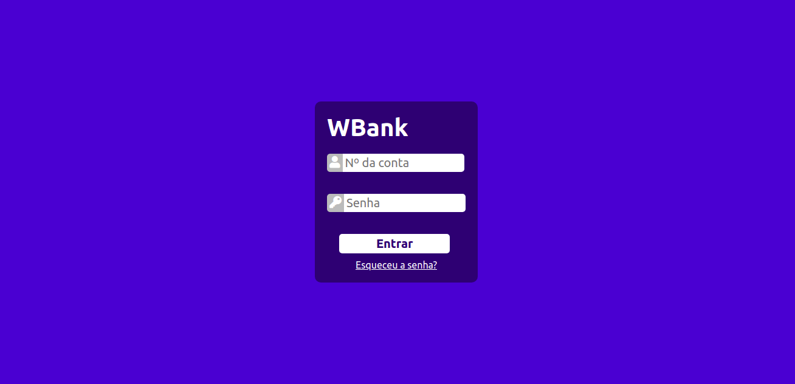
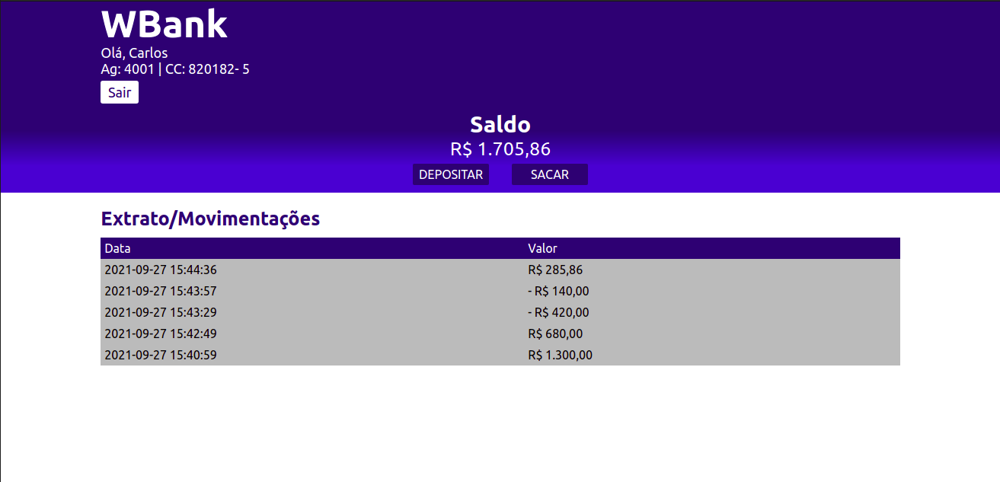

# **Projeto de um caixa eletrônico:**

# Sobre o projeto

Este é um projeto desenvolvido para o **curso de backend,** organizado pela [B7Web](https://b7web.com.br/), para praticar os conhecimentos adquiridos de PHP e MySQL.

É um sistema que visa simular algumas operações de um caixa eletrônico, onde o usuário pode acessar sua conta, realizar depósitos, saques e visualizar o extrato bancário.

## Layout

**Tela de login**

**Home**
    

# Tecnologias utilizadas

## Backend

- PHP
- MySQL

## Frontend

- HTML
- CSS

# Autor

Wanderson Adriano de Morais da Costa

[https://www.linkedin.com/in/wanderson-adriano-602612116](https://www.linkedin.com/in/wanderson-adriano-602612116)